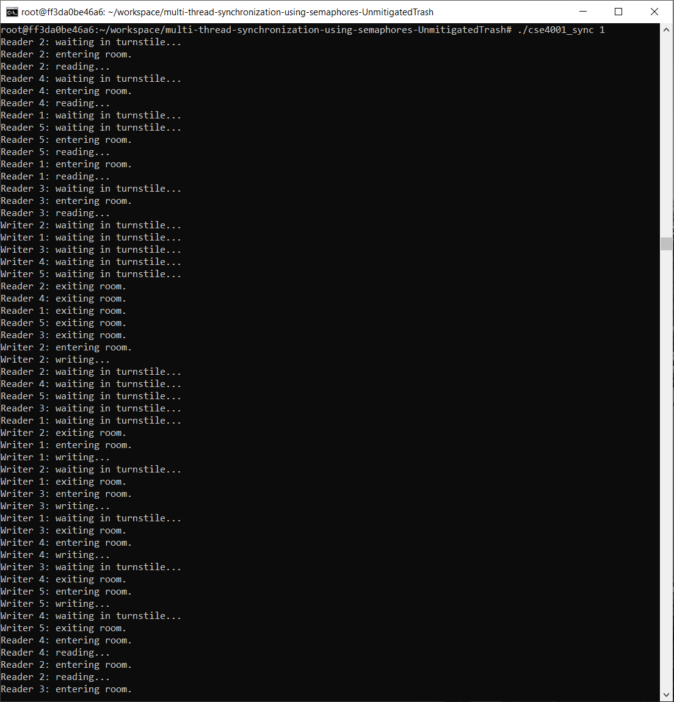
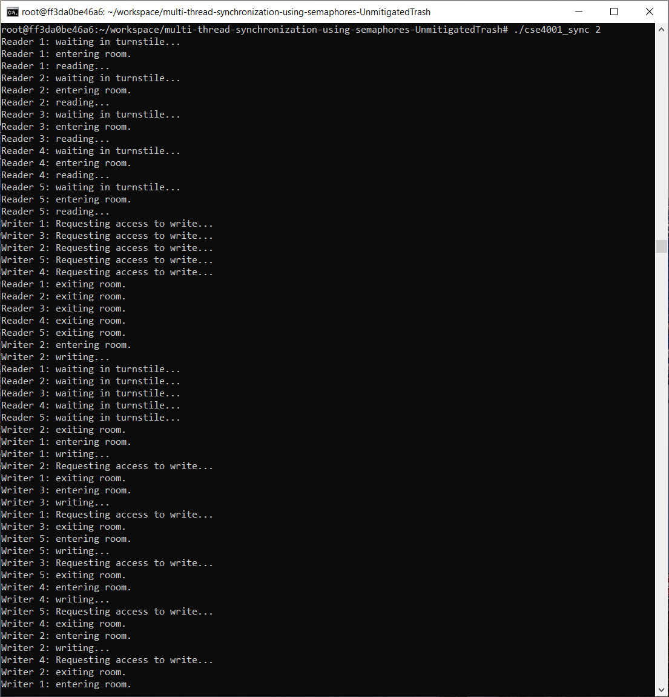
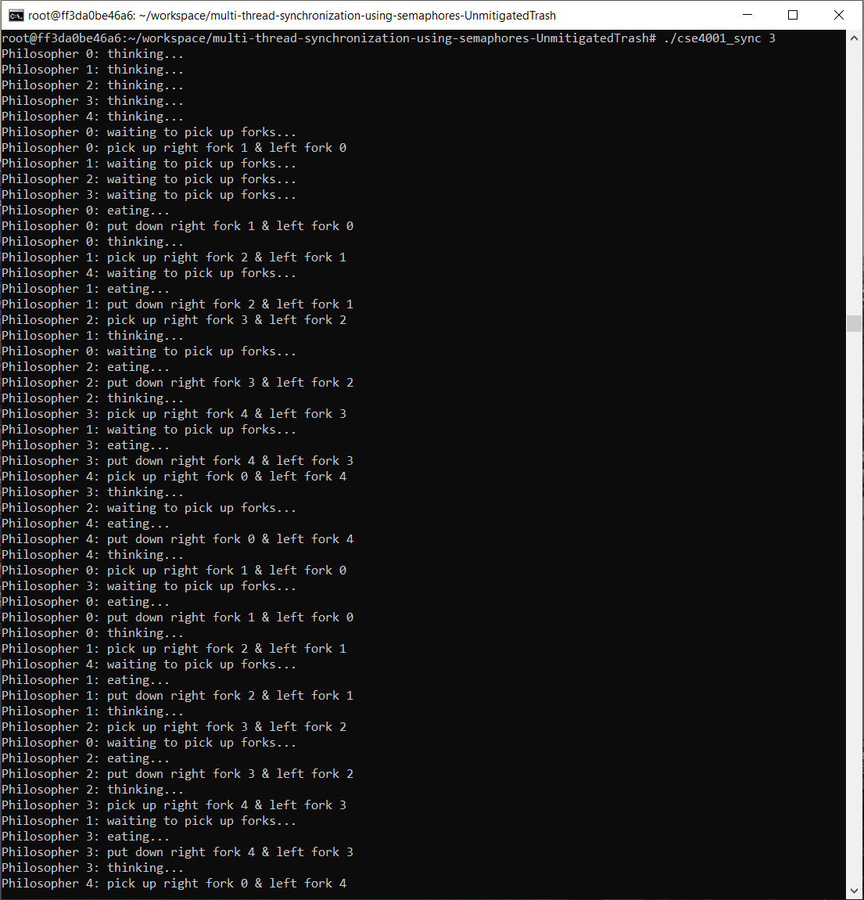

# cse4001_fall2025-multi-thread-synchronization-using-semaphores

## Compile and Run Instructions

Here a quick walkthough to get the program compiled and running. Make sure to follow these steps exactly!

### Step 1: Compiling cse4001_sync.cpp
While in the same directory as the makefile, run this command:

```
make
```

After running the command, you should see an output like this:

```
g++ -g cse4001_sync.cpp -o cse4001_sync -lpthread -l
{list of warnings...}
```

### Step 2: Running the Program

To run a solution, use this command:

`<solution #>` indicates which solution you would like to run.

```
./cse4001_sync <solution #>
```

For example, to run the solution of problem 1, you will call: 

```
./cse4001_sync 1
```

## Solution #1

No-Starve Reader-Writer: This solution works by allowing readers to lock the room using a lightswitch. Writers control a turnstile semaphore that limits how many readers can enter the room at a time. Locks were impemented within the `Lightswitch` class using semaphores and a counter.



## Solution #2

Writer-Priority Reader-Writer: This solution works by allowing both readers and writers to lock the room, but writers are given priority and must enter or leave the room at a time. On the other hand, readers enter one at a time but then exit in groups. Like before, locks were impemented within the `Lightswitch` class using semaphores and a counter.



## Solution #3

Dining Philosophers #1: This solution works by only allowing 4 philosophers to sit at the table at a time. This prevents the situation where all philosophers will be waiting for a second fork. An array of semaphores using the vector library was used, including modulo statements in `left` and `right` to get the left and right forks.



## Solution #4

Dining Philosopher #2: This solution works by ensuring that there is atleast one left-handed and right-handed philosopher at the table. When the situation comes, both philosopher can grab each others fork since they hold their asymmetricly to each other. Modulo statements were used in `grab_fork_2` and `grab_fork_2` so that even philosophers grab their right fork first and odd philosophers grab their left fork first.

